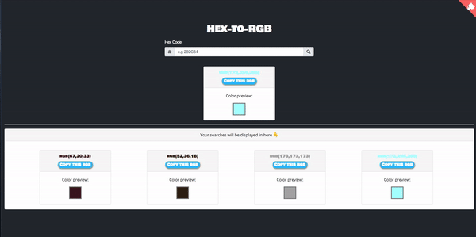
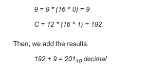

<div align="center"> 
  <h1>Hex To RGB Color Converter</h1>

[](http://makeapullrequest.com)
[](https://app.netlify.com/sites/hextorgb/deploys)



</div>

# Table Of Content

- [Table Of Content](#table-of-content)
  - [What is Hexadecimal?](#what-is-hexadecimal)
  - [What is Hexadecimal Color?](#what-is-hexadecimal-color)
  - [What is RGB?](#what-is-rgb)
  - [How The Conversion Work?](#how-the-conversion-work)
    - [Code](#code)
  - [Install](#install)
  - [References](#references)
  - [Toolbox Of This Project](#toolbox-of-this-project)
  - [TODO List](#todo-list)

## What is Hexadecimal?

- A hexadecimal, which is also called base 16 or "hex" for short, is a representation of four binary bits and consists of sixteen numbers and letters. The numbers in a hex are the same as decimal numbers: 0, 1, 2, 3, 4, 5, 6, 7, 8, 9. The big difference between a hex and a decimal is that a hex also contains letters. These letters are: A, B, C, D, E, F.

## What is Hexadecimal Color?

- A color hex code is a way of specifying color using hexadecimal values. The code itself is a hex triplet, which represents three separate values that specify the levels of the component colors. The code starts with a pound sign (#) and is followed by six hex values or three hex value pairs (for example, #AFD645). The code is generally associated with HTML and websites, viewed on a screen, and as such the hex value pairs refer to the RGB color space.


## What is RGB?

- RGB (red, green, and blue) refers to a system for representing the colors to be used on a computer display. Red, green, and blue can be combined in various proportions to obtain any color in the visible spectrum. Levels of R, G, and B can each range from 0 to 100 percent of full intensity. Each level is represented by the range of decimal numbers from 0 to 255 (256 levels for each color), equivalent to the range of binary numbers from 00000000 to 11111111, or hexadecimal 00 to FF. The total number of available colors is 256 x 256 x 256, or 16,777,216 possible colors.

## How The Conversion Work?

- To convert a hexadecimal to a decimal manually, you must start by multiplying the hex number by 16. Then, you raise it to a power of 0 and increase that power by 1 each time according to the hexadecimal number equivalent.
- We start from the right of the hexadecimal number and go to the left when applying the powers. Each time you multiply a number by 16, the power of 16 increases.
- When converting a C9 hexadecimal to a decimal your work should look something like this:

 

 ### Code

There are three steps to convert a Hex code to RGB:
- Get the 2 left digits of the hex color code and convert to decimal value to get the red color level.
- Get the 2 middle digits of the hex color code and convert to decimal value to get the green color level.
- Get the 2 right digits of the hex color code and convert to decimal value to get the blue color level.

So we get our hex code from the user and parse it into three seperate variable:
  
```js
   let red = parseInt(value.slice(0, 2), 16);
   let green = parseInt(value.slice(2, 4), 16);
   let blue = parseInt(value.slice(4, 6), 16);
```

## Install

[npm]():

- First install node_modules:

```sh
npm install
```

- Then you can run:

```sh
npm start
```

- Runs the app in the development mode. Open http://localhost:3000 to view it in the browser.

## References

- [Rgb (red,green and blue)](https://whatis.techtarget.com/definition/RGB-red-green-and-blue)
- [How to Convert Hexadecimal to Decimal and Decimal to Hex Manually](https://owlcation.com/stem/Convert-Hex-to-Decimal)

## Toolbox Of This Project 🧰 

- [react](https://tr.reactjs.org/)
- [bootstrap](https://www.npmjs.com/package/bootstrap)
- [react-spinners](https://www.npmjs.com/package/react-spinners)
- [react-toastify](https://www.npmjs.com/package/react-toastify)

## TODO List

- [x] Github Corners - http://tholman.com/github-corners/
- [ ] Auto Complete
- [x] Previous Searches
- [ ] RGB - To - Hex
- [x] Copy To Clipboard

## License

Hex-To-Rgb is [MIT licensed](./LICENSE).
